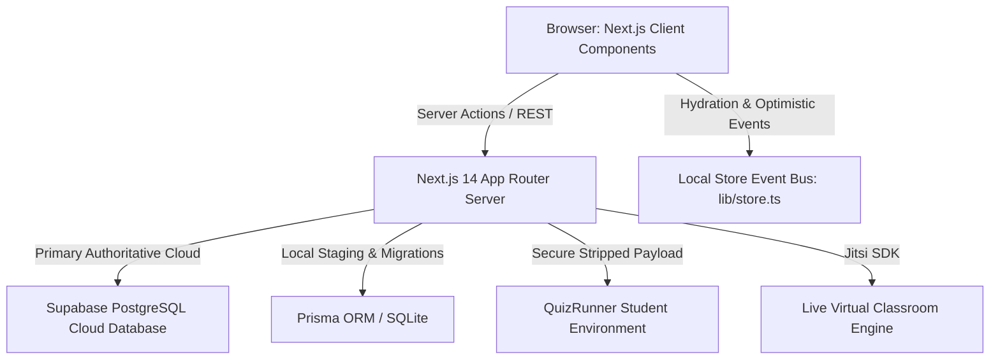
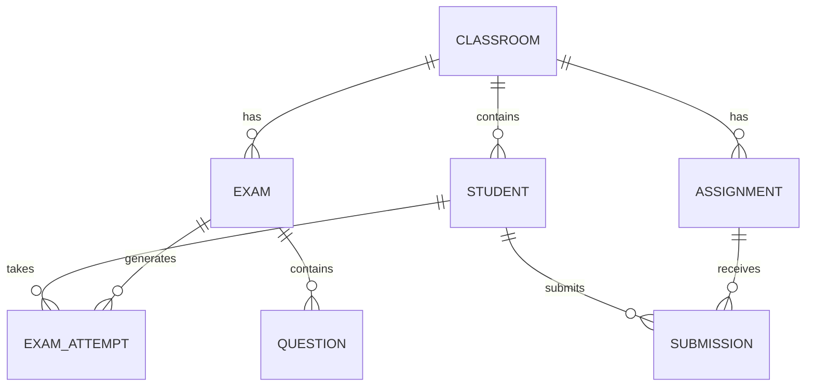

# 🎓 منصة التعليم الإلكتروني الذكية — Master Platform Manual (A to Z)
**The Definitive Architecture, Feature Specification, Database Schema & Developer Operations Guide**

---

## 📑 Table of Contents
1. [Executive Overview & Platform Identity](#1-executive-overview--platform-identity)
2. [High-Level Architecture & Tech Stack](#2-high-level-architecture--tech-stack)
3. [User Roles & Security Authentication](#3-user-roles--security-authentication)
4. [Cross-Module Platform Bonding & Event Bus](#4-cross-module-platform-bonding--event-bus)
5. [Complete Module Breakdown (A to Z)](#5-complete-module-breakdown-a-to-z)
   - [5.1 Teacher Dashboard & Executive Analytics](#51-teacher-dashboard--executive-analytics)
   - [5.2 Classrooms & Grade Management](#52-classrooms--grade-management)
   - [5.3 Students Directory & WhatsApp Reports](#53-students-directory--whatsapp-reports)
   - [5.4 Quizzes & Exams Engine](#54-quizzes--exams-engine)
   - [5.5 Strict Proctoring & Anti-Cheat System](#55-strict-proctoring--anti-cheat-system)
   - [5.6 Results, Auto-Grading & Single-Use Retake PINs](#56-results-auto-grading--single-use-retake-pins)
   - [5.7 Assignments & Homework Management](#57-assignments--homework-management)
   - [5.8 Live Virtual Classrooms (Jitsi Meet)](#58-live-virtual-classrooms-jitsi-meet)
   - [5.9 Student Experience & Portal](#59-student-experience--portal)
6. [Database Schema & Data Persistence (Dual-Tier)](#6-database-schema--data-persistence-dual-tier)
7. [Codebase Directory Structure & File Map](#7-codebase-directory-structure--file-map)
8. [Environment Variables & Deployment Guide](#8-environment-variables--deployment-guide)
9. [Verification, Testing & Maintenance Scripts](#9-verification-testing--maintenance-scripts)

---

## 1. Executive Overview & Platform Identity

- **Platform Name**: المنصة التعليمية الذكية (Smart Educational Platform)
- **Target Audience**: Egyptian & Arab World K-12 Tutoring, Independent Teachers, Academic Centers, and Schools.
- **Production URL**: [https://edu-platform-phi-pearl.vercel.app](https://edu-platform-phi-pearl.vercel.app)
- **GitHub Repository**: [https://github.com/ahmedmahmoudhanafy16-del/edu-platform.git](https://github.com/ahmedmahmoudhanafy16-del/edu-platform.git)
- **Core Philosophy**:
  1. **Zero Mock Data Policy**: Every single student, exam, classroom, and grade originates from real teacher entries stored in persistent cloud databases. No random dummy numbers.
  2. **Cross-Module Bonding**: Modifying an entity in one module (e.g. creating an exam or registering a student) updates every dependent view in real time (Classrooms count, Student quizzes, Dashboard metrics).
  3. **Uncompromising Exam Security**: Web-based exams with physical classroom proctoring rigor (anti-cheat screen blur, copy-paste blocking, linear question progression, student watermark).
  4. **Localized Bilingual UX**: Native Arabic with Cairo typography (`dir="rtl"`) alongside complete English support (`dir="ltr"`).

---

## 2. High-Level Architecture & Tech Stack



### Technology Matrix
| Layer | Technologies Used | Purpose |
| :--- | :--- | :--- |
| **Framework** | Next.js 14.1.0 (App Router) + React 18 | High-performance hybrid SSR, SSG, and Server Actions |
| **Language** | TypeScript 5.x | Strict compile-time type safety across frontend and backend |
| **Styling** | Tailwind CSS 3.4 + `next-themes` | Clean design system with warm stone neutrals and dark mode |
| **Typography** | Google Fonts: **Cairo** | Native, highly legible Arabic and English typography |
| **Internationalization** | `next-intl` (Request-based) | Locale prefixes (`/ar/`, `/en/`) with bidirectional layouts |
| **Primary Database** | **Supabase Cloud PostgreSQL** | Central relational database with table-level encryption |
| **Secondary ORM** | Prisma ORM 5.22 | Schema definitions, migrations, and fallback staging |
| **Icons** | Lucide React | Modern, lightweight, accessible icon set |
| **Notifications** | Sonner | Accessible, non-intrusive toast messages |
| **Live Meetings** | `@jitsi/react-sdk` | WebRTC low-latency virtual interactive classrooms |

---

## 3. User Roles & Security Authentication

The platform enforces Role-Based Access Control (RBAC) across 3 distinct user personas:

### 3.1 Teacher / Administrator
- **Authentication**: Email and password via `actions/auth.ts` -> `loginTeacherAction`.
- **Privileges**:
  - Full CRUD on Classrooms, Students, Quizzes, Questions, and Assignments.
  - Grade student submissions, release feedback, and issue single-use retake PINs.
  - Launch live video classrooms and generate room codes.
  - Export student reports directly to parents via formatted WhatsApp links.

### 3.2 Student
- **Authentication**: Unique Student Code (e.g., `STU-1001` or phone number) + 4-digit PIN via `actions/auth.ts` -> `loginStudentAction`.
- **Zero-Friction Onboarding**: Students do **not** need complex email registration. The teacher registers them once, and they log in with their assigned credentials.
- **Privileges**:
  - View enrolled classrooms, upcoming homework, and available exams.
  - Enter passcode-protected exams and submit responses.
  - Review graded quiz results with correct answers and explanations.
  - Track academic progress on the personal Gradebook and Class Leaderboard.

### 3.3 Parent (Guardian)
- **Access Flow**: Seamless WhatsApp summary reports dispatched by the teacher.
- **Data Presented**: Student attendance rate, completed exams, grade percentages, assignment submission status, and teacher notes.

---

## 4. Cross-Module Platform Bonding & Event Bus

A fundamental innovation of the platform is **Entity Bonding**: changes made in any screen propagate instantly across all pages without requiring manual browser reloads.

### Event Bus Architecture (`lib/store.ts`):
```typescript
// Dispatched on any mutation (Create, Update, Delete)
window.dispatchEvent(new Event('edu_quizzes_updated'));
window.dispatchEvent(new Event('edu_classrooms_updated'));
window.dispatchEvent(new Event('edu_assignments_updated'));
window.dispatchEvent(new Event('edu_students_updated'));
window.dispatchEvent(new Event('edu_store_updated'));
```

### Real-Time Bonding Examples:
1. **Teacher creates an exam for "Primary 4"**:
   - The "Primary 4" card on `/teacher/classrooms` immediately increments its **Quizzes count** from 0 to 1.
   - The Teacher Dashboard overview stat increments its **Total Quizzes** count.
   - The Student Portal (`/student` and `/student/quizzes`) displays the new exam under available quizzes.
2. **Teacher hides an exam**:
   - Students who haven't taken it can no longer see it.
   - Students who already took it retain their grades in their Gradebook.
3. **Teacher deletes an exam**:
   - All associated questions, student results, and retake codes are cleanly purged from the system.

---

## 5. Complete Module Breakdown (A to Z)

---

### 5.1 Teacher Dashboard & Executive Analytics
- **Path**: `app/[locale]/(dashboard)/teacher/page.tsx`
- **Component**: `TeacherDashboardOverviewClient.tsx`
- **Features**:
  - **4 Executive KPI Cards**: Total Classrooms, Enrolled Students, Active Quizzes, and Pending Submissions.
  - **Live Class Alert Banner**: Displays active virtual sessions with a direct "Join Now" button.
  - **Classrooms Strip**: Quick-access cards with student counts and direct navigation.
  - **Assignments Queue**: Shows homework needing manual grading or feedback.

---

### 5.2 Classrooms & Grade Management
- **Path**: `app/[locale]/(dashboard)/teacher/classrooms/page.tsx`
- **Component**: `TeacherClassroomsClient.tsx`
- **Supported Academic Grades**:
  - **Primary**: Grade 4 (Primary 4), Grade 5 (Primary 5), Grade 6 (Primary 6).
  - **Preparatory**: Grade 7 (Prep 1), Grade 8 (Prep 2), Grade 9 (Prep 3).
  - **Secondary**: Grade 10 (Sec 1), Grade 11 (Sec 2), Grade 12 (Sec 3).
- **Features**:
  - Create new classrooms with custom names, grade tags, and descriptions.
  - Active/Inactive toggle: deactivating a classroom safely pauses student submissions.
  - Dynamic bonding: displays exact count of enrolled students, linked quizzes, and assignments.

---

### 5.3 Students Directory & WhatsApp Reports
- **Path**: `app/[locale]/(dashboard)/teacher/students/page.tsx`
- **Component**: `TeacherStudentsClient.tsx`
- **Features**:
  - **Add Student Modal (`AddStudentModal.tsx`)**: Auto-generates the next guaranteed non-colliding Student Code (e.g. `STU-1002`).
  - **Parent Phone Integration**: Stores verified Egyptian phone numbers (`010...`, `011...`, `012...`, `015...`).
  - **WhatsApp Performance Dispatch**: One click generates a pre-formatted WhatsApp message:
    > "السلام عليكم، تقرير أداء الطالب [اسم الطالب] في مادة الرياضيات: نسبة الحضور 100%، درجات الامتحانات: 10/10... مع تحيات المعلم."

---

### 5.4 Quizzes & Exams Engine
- **Path**: `app/[locale]/(dashboard)/teacher/quizzes/page.tsx`
- **Component**: `TeacherQuizzesClient.tsx`
- **Creation & Edit Modal (`CreateQuizModal.tsx`)**:
  - **Live Summary Pill Bar (Persistent Header)**:
    - Classroom badge (`Primary 4`).
    - Question count (`2 Questions`).
    - Total Marks (`8 pts`).
    - Dynamic Passing Score calculation (`Pass: 4.8 pts (60%)`).
    - Access Code indicator (`Code: QZ-9472`).
  - **Tab 1: ⚙️ Exam Settings & Passcode**:
    - Title, Classroom selector, Exam Type (Weekly Quiz, Monthly Exam, Final Exam).
    - Duration in minutes.
    - Passing Score percentage with quick preset buttons (`50%`, `60%`, `75%`) and live point calculation.
    - Passcode generator (`QZ-XXXX`) with enable/disable toggle.
    - Anti-Cheat & Proctoring security badge.
    - Quick navigation: `Next: Questions Bank →` and `Quick Save`.
  - **Tab 2: 📝 Questions Bank & Scoring**:
    - Individual score input for each question.
    - Equal distribution button ("توزيع بالتساوي"): spreads total marks equally across all questions.
    - Add Question button & Delete Question button.
    - Multiple Choice (MCQ) options with radio button to set the authoritative `correctAnswer`.
    - `Back to Settings` and `Save Changes / Publish Exam` buttons.

---

### 5.5 Strict Proctoring & Anti-Cheat System
- **Components**: `QuizRunner.tsx`, `ExamSecurityShield.tsx`
- **Security Protections**:
  1. **Dual Randomization**:
     - Question order is randomly shuffled uniquely for each student.
     - MCQ option choices (A, B, C, D) are randomly permuted for every student.
  2. **Copy / Paste & Context Menu Lockdown**:
     - Selecting text, right-clicking, copying (`Ctrl+C`), cutting (`Ctrl+X`), and pasting (`Ctrl+V`) are strictly blocked.
  3. **Screenshot & Print Interception**:
     - `PrintScreen` and `Snipping Tool` hotkeys trigger an instant blank screen.
     - `@media print` rules hide the exam content completely.
  4. **Privacy Shield (Tab Switch Detection)**:
     - If the student leaves the browser tab or switches to another window, an opaque blur curtain covers the exam immediately, recording a security violation.
  5. **Dynamic Anti-Leak Watermark**:
     - Semi-transparent, repetitive watermark containing the student's **Full Name, Student Code, and Phone Number** spans the screen to deter camera photo leaks.
  6. **Per-Question Countdown & Linear Progression**:
     - Strict linear flow: once a student moves to the next question, previous questions are locked (`Previous Locked`).
     - Real-time countdown timer per question with visual color-coded progress.

---

### 5.6 Results, Auto-Grading & Single-Use Retake PINs
- **Server Action**: `actions/quiz.ts` -> `submitQuizAnswers`
- **Features**:
  - **Instant Server-Side Grading**: Answers are evaluated against the authoritative cloud answer key.
  - **Security Stripping**: Student payload **never** contains correct answers during exam runtime.
  - **Results Modal (`QuizResultsAndRetakeModal.tsx`)**:
    - Roster of all student attempts with individual scores, percentages, and timestamps.
  - **Single-Use Retake PIN System**:
    - If a student encounters an emergency (e.g. power loss), the teacher can generate a single-use authorization PIN:
      `RETAKE-[quizId]-[random]`
    - The student enters this PIN via `QuizPasscodeModal.tsx` to unlock a fresh retake attempt. The PIN is automatically consumed (`isUsed: true`).

---

### 5.7 Assignments & Homework Management
- **Path**: `app/[locale]/(dashboard)/teacher/assignments/page.tsx`
- **Component**: `TeacherAssignmentsClient.tsx`
- **Features**:
  - Create homework tasks linked to specific classrooms with strict due dates.
  - Student submissions support detailed written answers or PDF uploads.
  - Teacher grading interface with numeric score, maximum points, and teacher remarks.

---

### 5.8 Live Virtual Classrooms (Jitsi Meet)
- **Path**: `app/[locale]/(dashboard)/teacher/live/page.tsx`
- **Component**: `TeacherLiveClient.tsx`
- **Features**:
  - Instant one-click virtual classroom launch.
  - Secure room code generation.
  - Jitsi Meet WebRTC integration with Arabic language controls.
  - Automatic attendance tracking logging the student's join time.

---

### 5.9 Student Experience & Portal
- **Dashboard**: `app/[locale]/(dashboard)/student/page.tsx`
- **Exams Bank**: `app/[locale]/(dashboard)/student/quizzes/page.tsx`
- **Gradebook**: `app/[locale]/(dashboard)/student/grades/page.tsx`
- **Leaderboard**: `app/[locale]/(dashboard)/student/leaderboard/page.tsx`
- **Review Mode**: `app/[locale]/(dashboard)/student/quizzes/[id]/review/page.tsx`
  - Students can review completed exams, seeing which questions they got right, which were incorrect, and read model answers.

---

## 6. Database Schema & Data Persistence (Dual-Tier)

The platform employs a robust **Dual-Tier Database Architecture** ensuring zero data loss and seamless offline/online transitions:



### 6.1 Supabase Cloud Tables (`lib/supabase.ts`)
| Table Name | Primary Columns | Purpose |
| :--- | :--- | :--- |
| `students` | `id (UUID), student_code, full_name, phone, parent_phone, grade_level, password_hash, is_active, created_at` | Student profiles, credentials, and central store container |
| `exams` | `id (UUID), title, description, duration_minutes, passing_score, total_marks, is_published, created_at` | Published exams and master configuration |
| `questions` | `id (UUID), exam_id, question_text, options (JSONB), correct_answer, score, order_index` | Questions bank with points and answer keys |
| `exam_attempts` | `id (UUID), exam_id, student_id, final_score, status, answers (JSONB), completed_at` | Student submissions, auto-grades, and attempts |
| `assignments` | `id (UUID), classroom_id, title, description, due_date, max_score, created_at` | Homework tasks and instructions |
| `assignment_submissions` | `id (UUID), assignment_id, student_id, content, file_url, score, feedback, submitted_at` | Student homework uploads and teacher grading |
| `classrooms` | `id (UUID), name, grade_level, is_active, created_at` | Academic classrooms and cohorts |
| `live_sessions` | `id (UUID), room_code, title, target_grade, is_active, started_at` | Active and historical video classrooms |

### 6.2 Central Document Store (`__SYSTEM_QUIZZES_STORE__`)
To prevent PostgreSQL UUID mismatch errors when handling client-generated identifiers, a persistent document store row is maintained in the `students` table (`student_code = '__SYSTEM_QUIZZES_STORE__'`). This stores full quiz structures (including custom question weights and passcode settings) with instant cloud synchronization.

---

## 7. Codebase Directory Structure & File Map

```text
edu-platform/
├── actions/                          # Next.js Server Actions (Database Mutations)
│   ├── auth.ts                       # Teacher and student login / logout actions
│   ├── quiz.ts                       # Quiz creation, secure fetch, submission & grading
│   ├── classroom.ts                  # Classroom CRUD actions
│   └── assignment.ts                 # Assignment creation and grading actions
│
├── app/                              # Next.js 14 App Router Directory
│   ├── [locale]/                     # Bilingual route wrapper (ar / en)
│   │   ├── (auth)/                   # Authentication routes (login, student-login)
│   │   ├── (dashboard)/
│   │   │   ├── teacher/              # Teacher administrative portal
│   │   │   │   ├── page.tsx          # Teacher Dashboard Overview
│   │   │   │   ├── classrooms/       # Classroom management
│   │   │   │   ├── quizzes/          # Quizzes bank & editor
│   │   │   │   ├── students/         # Student directory & credentials
│   │   │   │   ├── assignments/      # Homework management
│   │   │   │   └── live/             # Virtual live meetings
│   │   │   └── student/              # Student portal
│   │   │       ├── page.tsx          # Student Dashboard
│   │   │       ├── quizzes/          # Available exams list
│   │   │       │   └── [id]/         # Secure Exam Runner (`QuizRunner.tsx`)
│   │   │       │       └── review/   # Post-exam review with correct answers
│   │   │       ├── assignments/      # Homework submissions
│   │   │       ├── grades/           # Personal gradebook
│   │   │       └── leaderboard/      # Class honors board
│   │   └── layout.tsx                # Master root layout with Cairo font & providers
│   └── api/                          # REST API Endpoints (Quizzes, Health, Auth)
│
├── components/                       # Reusable React UI Components
│   ├── teacher/
│   │   ├── CreateQuizModal.tsx       # Dual-tab exam creator with dynamic passing score
│   │   ├── QuizResultsAndRetakeModal.tsx # Results roster & Single-use PIN generator
│   │   └── AddStudentModal.tsx       # Student registration modal
│   ├── student/
│   │   ├── StudentQuizCard.tsx       # Exam card with passcode prompt
│   │   └── QuizPasscodeModal.tsx     # Access code & retake PIN verification modal
│   ├── shared/
│   │   └── ExamSecurityShield.tsx    # Anti-cheat blur curtain & violation detector
│   └── ui/                           # Base UI primitives (Button, Input, Card, Modal)
│
├── lib/                              # Core Utility Libraries & Database Clients
│   ├── supabase.ts                   # Supabase Cloud client & dual-tier store methods
│   ├── prisma.ts                     # Prisma ORM client singleton
│   ├── store.ts                      # Client-side state store & cross-module event bus
│   ├── auth.ts                       # Session tokens & cookie handlers
│   ├── shuffle.ts                    # Cryptographic randomization utilities
│   └── utils.ts                      # Tailwind merge, date formatting & math utilities
│
└── scripts/                          # Automated Verification & Test Suites
    ├── test-quizzes-system-logic.js  # 35-point algorithmic exam verification test
    ├── test-quiz-hide-vs-delete.js   # Hide vs delete behavioral audit
    └── test-master-e2e-integrations.js # End-to-end platform bonding audit
```

---

## 8. Environment Variables & Deployment Guide

### 8.1 Required Environment Variables (`.env.local`)
```ini
# Next.js Application
NODE_ENV=production
NEXT_PUBLIC_APP_URL=https://edu-platform-phi-pearl.vercel.app

# Supabase Cloud Database (Authoritative)
NEXT_PUBLIC_SUPABASE_URL=https://your-project.supabase.co
NEXT_PUBLIC_SUPABASE_ANON_KEY=your-anon-key
SUPABASE_SERVICE_ROLE_KEY=your-service-role-key

# Prisma Local / Staging Database
DATABASE_URL=file:./dev.db
```

### 8.2 Deployment Steps (Vercel)
1. Commit changes and push to GitHub:
   ```bash
   git add .
   git commit -m "feat: platform update"
   git push origin main
   ```
2. Vercel automatically detects the push, runs `scripts/prepare-db.js`, compiles TypeScript, generates Prisma clients, and executes `next build`.
3. The platform is deployed globally to Vercel's Edge Network in under 60 seconds.

---

## 9. Verification, Testing & Maintenance Scripts

The platform includes comprehensive automated test suites to ensure zero regressions:

### 9.1 Master Quizzes & Scoring Logic Audit
```bash
node scripts/test-quizzes-system-logic.js
```
- **Tests (35/35 Passing)**:
  - Arabic normalization (alef variants, teh marbuta, diacritic removal).
  - Floating-point and fractional score distribution (e.g. 10 points over 3 questions).
  - Accurate auto-grading (MCQ string matching, 0/1-indexed values).
  - Secure correctAnswer stripping on student endpoints.
  - Zero star emojis audit across all views.

### 9.2 Hide vs. Delete Behavioral Verification
```bash
node scripts/test-quiz-hide-vs-delete.js
```
- **Tests (10/10 Passing)**:
  - Validates that hiding an exam preserves existing student grades while concealing it from new students.
  - Validates that deleting an exam completely cascades across results, questions, and submissions with zero orphaned records.

---

## 🏁 Summary
**المنصة التعليمية الذكية** represents a complete, real-world, enterprise-grade educational solution. By combining real-time cloud persistence, an intuitive bilingual UI, rigorous anti-cheat proctoring, and seamless cross-module data bonding, the platform guarantees a dependable experience for educators and students alike.
